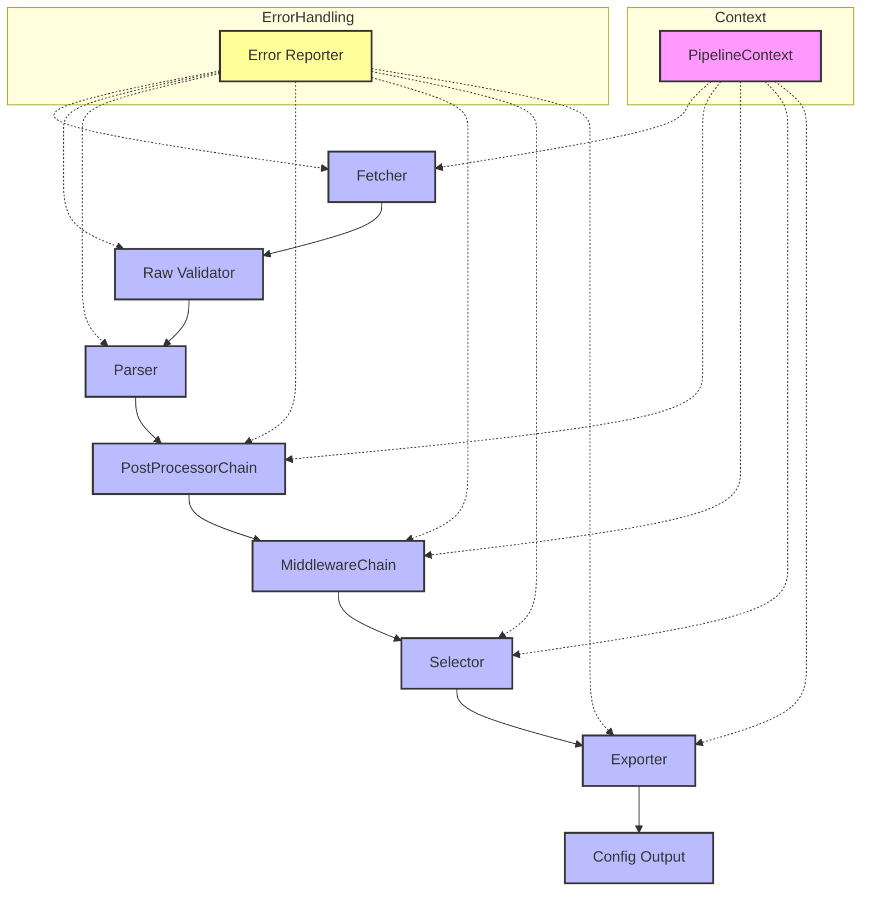

# subbox manager

[](https://github.com/kpblcaoo/update-singbox/actions)
[](https://github.com/kpblcaoo/update-singbox/actions)
[](LICENSE)

## Other languages / Другие языки
- [Русский (docs/ru/README.md)](docs/ru/README.md)

A Python CLI tool for automating and managing [sing-box](https://sing-box.sagernet.org/) proxy configurations. Fetches server lists from a URL, applies exclusions, generates configs, and supports advanced routing and testing.

---

## ✨ Features
- Fetch and apply proxy server configs from a URL
- Supported protocols: VLESS, Shadowsocks, VMess, Trojan, TUIC, Hysteria2
- **NEW in 1.5.0**: CLI inbound parameters for easy proxy configuration
- Direct routing for Russian domains and geoip-ru, proxy for other traffic
- Logging, backup, exclusions, dry-run, and full CLI test coverage
- All paths and artifacts are configurable via environment variables
- Modular architecture, fully tested with pytest + Typer.CliRunner

## Pipeline Architecture

The pipeline is built on a modular architecture with plugin support for fetcher, parser, exporter, selector, postprocessor, and middleware. All stages are covered by fail-tolerance, caching, i18n, edge tests, and best practices.



- **DX/CLI generator**: plugin template generator (fetcher, parser, exporter, postprocessor, validator) with tests and best practices.
- **i18n**: multilingual CLI, fallback, sanitization, automated sync_keys.py, edge tests.
- **Middleware**: extensible middleware chain with edge tests, logging, fail-tolerance.
- **Caching**: in-memory cache for SubscriptionManager and fetcher, force_reload support.
- **Fail-tolerance**: partial_success, strict/tolerant modes, Error Reporter, edge test coverage.
- **Coverage**: >90% test coverage, dedicated edge tests for all pipeline layers.
- **Best practices**: modular architecture, Google-style docstrings, auto-documentation, SEC checklists, DX utilities.
- **SEC validation for inbounds**: all inbounds are validated via pydantic (V2): bind only to localhost/private, ports 1024-65535, external bind requires explicit confirmation, edge tests, see cli_security.md for profile example.

---

## 🚀 Quick start

```bash
python -m venv .venv
source .venv/bin/activate
pip install .
cp .env.example .env  # Edit as needed
sboxctl run -u https://example.com/proxy-config.json --index 1
```

- See `.env.example` for all environment variables you can configure (paths, URLs, debug, etc).
- **Note:** By default, the config is written to `/etc/sing-box/config.json` (default for sing-box). If your sing-box installation uses a different path, set `SBOXMGR_CONFIG_FILE` accordingly in your `.env`.
- For development, see DEVELOPMENT.md.

---

## 🚀 Installation

```bash
python -m venv .venv
source .venv/bin/activate
pip install .
cp .env.example .env  # Edit as needed
```

Requirements: Python 3.10+, sing-box, requests[socks], python-dotenv

### Sing-box Version Compatibility

**Recommended:** sing-box 1.11.0 or higher

- **sing-box 1.11.0+**: Full support with modern rule actions syntax
- **sing-box < 1.11.0**: Automatic compatibility mode with legacy special outbounds (`block`, `dns`)

The tool automatically detects your sing-box version and adapts the configuration format:
- For newer versions: Uses modern `rule actions` (recommended)
- For older versions: Falls back to legacy `special outbounds` for compatibility

To skip version checking (not recommended):
```bash
sboxctl run -u <url> --skip-version-check
```

⚠️ **Note**: Legacy special outbounds are deprecated and will be removed in sing-box 1.13.0. Please update to sing-box 1.11.0+ for best experience.

---

## ⚙️ Usage

All commands are available via the `sboxctl` CLI (Typer-based):

### Typical scenarios

- **Run with server selection by index:**
  ```bash
  sboxctl run -u https://example.com/proxy-config.json --index 1
  # Generates config.json for the selected server
  ```
- **Export with CLI inbound parameters (NEW in 1.5.0):**
  ```bash
  sboxctl export -u https://example.com/proxy-config.json --inbound-types socks --socks-port 1080
  # Configure proxy interfaces directly via CLI
  ```
- **Dry-run (simulate config generation, no file changes):**
  ```bash
  sboxctl dry-run -u https://example.com/proxy-config.json
  # Prints config to stdout, does not write files
  ```
- **List all available servers:**
  ```bash
  sboxctl list-servers -u https://example.com/proxy-config.json
  # Shows a table of all servers with indices and remarks
  ```
- **Add server to exclusions:**
  ```bash
  sboxctl exclusions -u https://example.com/proxy-config.json --add 1
  # Adds server with index 1 to exclusions.json
  ```
- **Remove server from exclusions:**
  ```bash
  sboxctl exclusions -u https://example.com/proxy-config.json --remove 1
  # Removes server with index 1 from exclusions.json
  ```
- **View current exclusions:**
  ```bash
  sboxctl exclusions --view
  # Prints the current exclusions list
  ```
- **Clear all exclusions:**
  ```bash
  sboxctl clear-exclusions
  # Empties exclusions.json
  ```

### Options
| Option                  | Description                                      |
|------------------------|--------------------------------------------------|
| `-u, --url <URL>`      | Proxy config URL (required)                      |
| `--index <n>`          | Select server by index                           |
| `--remarks <name>`     | Select server by remarks                         |
| `--dry-run`            | Simulate config generation, no file changes      |
| `--list-servers`       | List all available servers                       |
| `--exclusions`         | Manage exclusions (add/remove/list)              |
| `--clear-exclusions`   | Remove all exclusions                            |
| `-d, --debug <level>`  | Set log verbosity (0=min, 1=info, 2=debug)       |

---

## 🛠 CLI architecture

- The CLI is built with [Typer](https://typer.tiangolo.com/), providing modular commands and automatic help.
- Each scenario (run, dry-run, exclusions, list-servers, clear-exclusions) is implemented as a separate command in the `cli/` package.
- CLI wrappers are thin: they only orchestrate, all business logic is in core modules (see `core/`, `utils/`).
- All paths and artifacts (config, log, exclusions, etc.) are controlled via environment variables (see `.env.example`).
- To add or extend commands, create a new file in `cli/` and register it in the main Typer app.
- For development and contribution guidelines, see DEVELOPMENT.md.

## 🐞 Known bugs & limitations

- Server indices in `list-servers` may start from a non-zero value if the list is filtered. [Planned: re-index from 0]
- Removing exclusions by index or ID may not work as expected. Use `sboxctl clear-exclusions --yes` or edit `exclusions.json` as a workaround. [Planned: improve UX]
- See [TODO.md](./TODO.md) or [plans/struct_refactor_next_steps.md](./plans/struct_refactor_next_steps.md) for the full list of known issues and plans.

---

## 🧪 Testing

Run all tests:
```bash
pytest -v tests/
```

All CLI logic is covered by tests using Typer.CliRunner and pytest. Artifacts and paths are isolated via environment variables in tests.

---

## 🛠 Configuration & Environment

All paths are configurable via environment variables:

| Variable                        | Default Value                |
|---------------------------------|------------------------------|
| `SBOXMGR_CONFIG_FILE`           | ./config.json                |
| `SBOXMGR_TEMPLATE_FILE`         | ./config.template.json       |
| `SBOXMGR_LOG_FILE`              | ~/.local/share/sboxmgr/sboxmgr.log (or ./sboxmgr.log) |
| `SBOXMGR_EXCLUSION_FILE`        | ./exclusions.json            |
| `SBOXMGR_SELECTED_CONFIG_FILE`  | ./selected_config.json       |
| `SBOXMGR_URL`                   | (no default, must be set)    |

You can use a `.env` file in the project root for local development.

**Note on logging:** By default, logs are written to `~/.local/share/sboxmgr/sboxmgr.log` (XDG Base Directory spec). If this directory is not writable, logs fall back to `./sboxmgr.log` in the current directory. For system service deployment, set `SBOXMGR_LOG_FILE=/var/log/sboxmgr.log` explicitly.

---

## 🤝 Contributing

Contributions are welcome! Fork, make changes, and submit a Pull Request.

---

## 📜 License

This project is licensed under the terms of the MIT License. See the LICENSE file for details.

## Расширение: плагины и генератор шаблонов

Для быстрого старта новых fetcher, parser, exporter, postprocessor, validator используйте CLI-генератор шаблонов:

- Примеры команд, шаблонов и best practices см. в [docs/plugins/README.md](docs/plugins/README.md)
- Генератор: `sboxctl plugin-template <type> <ClassName> --output-dir ./src/sboxmgr/subscription/<type>s/`

Это ускоряет разработку, стандартизирует docstring и тесты, облегчает онбординг новых контрибьюторов.

## Edge-case coverage

- Все ключевые edge-cases пайплайна покрыты тестами (см. [docs/tests/edge_cases.md](docs/tests/edge_cases.md)).
- Для каждого слоя (fetch, parse, postprocess, middleware, export, i18n, DX/CLI) есть отдельные edge-тесты.
- Критичные SEC edge-cases:
  - Parser: вредоносный payload (инъекции, DoS, eval)
  - Fetcher: нестандартные схемы (ftp://, data://, chrome-extension://)
  - Middleware: unsafe hook/external command (sandbox, privilege escalation)
  - Postprocessor: внешний enrichment без таймаута/валидации
- Поведение пайплайна при ошибках: partial_success, fallback, логирование, пайплайн не падает.
- См. также: sec_checklist.md, tests/edge/README.md

## Best Practices & Security

- The project implements multi-layer SEC validation, fail-tolerant pipeline, and a plugin-based architecture.
- For details on security, threat model, and checklists, see:
  - [Security Model](docs/security.md)
  - [SEC Checklist](docs/sec_checklist.md)
  - [Architecture](docs/arch/)


