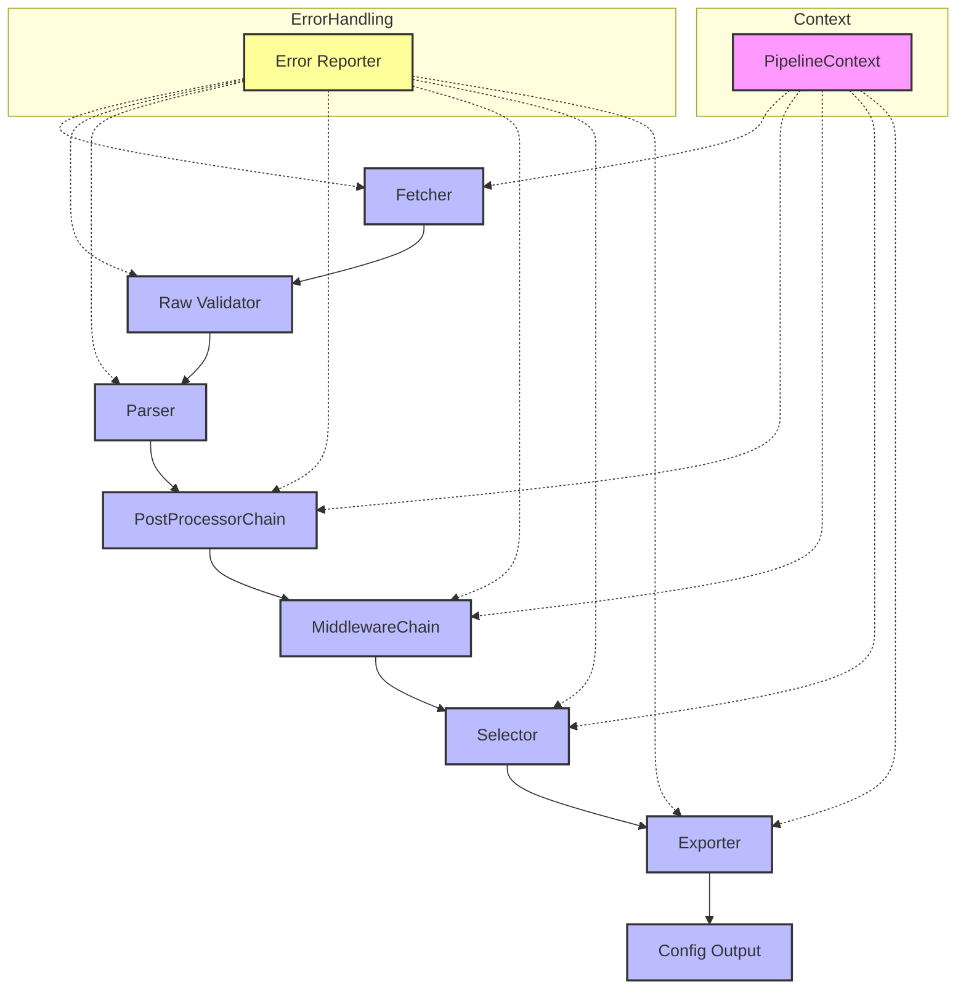
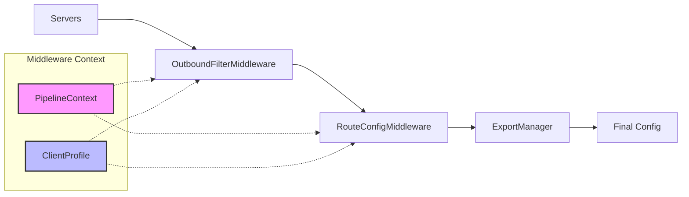

# Pipeline Architecture

## Overview

The sboxmgr pipeline is built on a modular architecture with plugin support for fetcher, parser, exporter, selector, postprocessor, and middleware. All stages are covered by fail-tolerance, caching, i18n, edge tests, and best practices.

## Pipeline Flow



## Middleware Chain

The middleware chain is a key component that processes servers and configuration before export. It provides:

- **OutboundFilterMiddleware**: Filters outbounds based on exclude_outbounds configuration
- **RouteConfigMiddleware**: Configures routing rules based on routing.final configuration

### Middleware Flow



### OutboundFilterMiddleware

Filters outbound servers based on configuration:

```python
# Configuration
client_profile = ClientProfile(
    exclude_outbounds=["direct", "block", "dns"]
)

# Middleware automatically filters out these outbound types
```

### RouteConfigMiddleware

Configures routing rules based on final destination:

```python
# Configuration
client_profile = ClientProfile(
    routing={"final": "proxy"}
)

# Middleware sets route.final = "proxy" in output config
```

## Export Manager Integration

The ExportManager automatically configures middleware based on ClientProfile settings:

```python
from sboxmgr.export.export_manager import ExportManager

# Automatic middleware configuration
export_manager = ExportManager()
config = export_manager.export(client_profile)

# Manual middleware override
export_manager = ExportManager()
export_manager.add_middleware(OutboundFilterMiddleware(['direct']))
export_manager.add_middleware(RouteConfigMiddleware({'final': 'block'}))
config = export_manager.export(client_profile)
```

## CLI Integration

CLI flags provide direct access to middleware functionality:

```bash
# Set final routing destination
sboxctl export -u <url> --final-route direct

# Exclude specific outbound types
sboxctl export -u <url> --exclude-outbounds block,dns

# Combine both
sboxctl export -u <url> --final-route proxy --exclude-outbounds direct,block
```

## Error Handling

The pipeline implements comprehensive error handling:

- **Partial Success**: Pipeline continues even if some stages fail
- **Fallback Mechanisms**: Automatic fallbacks for common failure scenarios
- **Error Reporting**: Detailed error reporting with context
- **Logging**: Comprehensive logging at all stages

## Testing

All pipeline components are thoroughly tested:

- **Unit Tests**: Individual component testing
- **Integration Tests**: Full pipeline testing
- **Edge Case Tests**: Boundary condition testing
- **Error Tests**: Failure scenario testing

## Extensibility

The pipeline is designed for easy extension:

- **Plugin Architecture**: Easy to add new fetchers, parsers, exporters
- **Middleware System**: Extensible middleware chain
- **Configuration**: Flexible configuration system
- **Documentation**: Comprehensive documentation and examples
